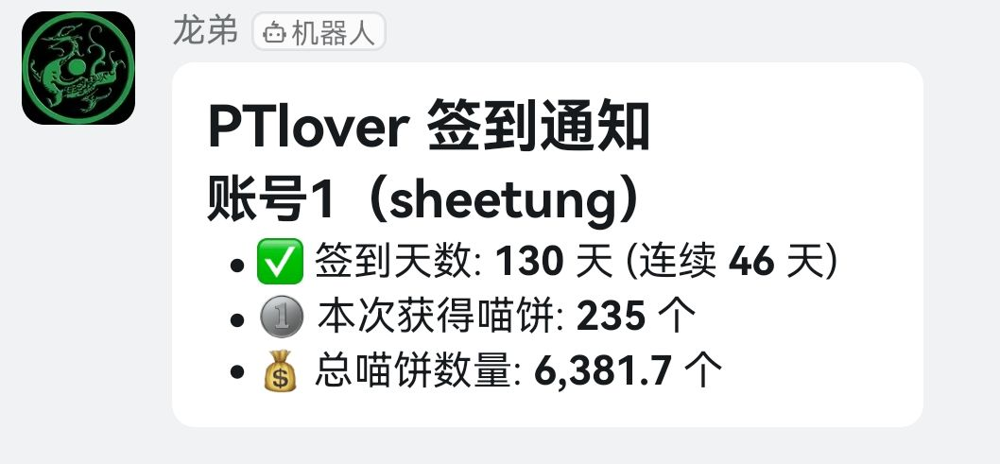
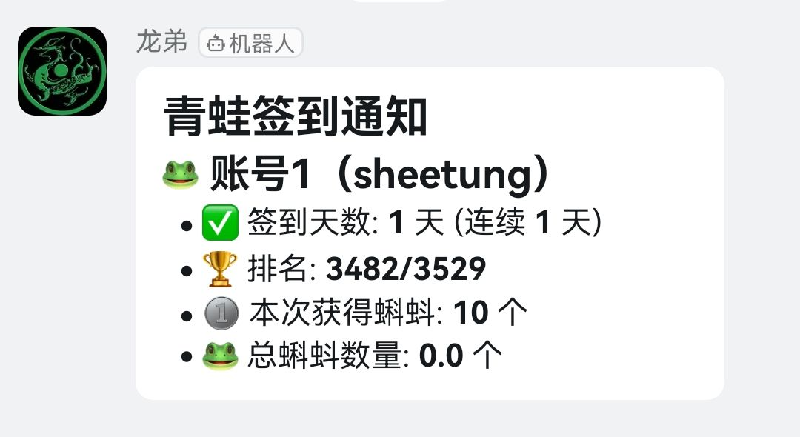

# PT_CHECK

一款为pt站点提供每日签到的脚本

目前支持

1. ptlover
2. 青蛙

<p align="center">  </p>
<p align="center">  </p>

### 🛠 使用方法

#### 1. 安装依赖

```bash
复制编辑
pip install -r requirements.txt
```

> `requirements.txt` 内容：

```
beautifulsoup4
```

青龙中以来添加方法：依赖管理-->Python3-->创建依赖-->添加名称`BeautifulSoup4`

> [!TIP]
>
> 建议headers中的内容在浏览器中F12自己获取
>
> 如果签到成功但是并未通知，请检查钉钉机器人的关键词配置

~~由于还未完成自动添加为青龙任务，需要手动添加~~已适配


#### 2. 设置环境变量

你可以通过 `.env` 文件、系统环境变量，或 GitHub Actions `secrets` 设置以下变量：

| 环境变量名        | 说明                                              |
| ----------------- | ------------------------------------------------- |
| `PTLOVER_COOKIES` | 用于爱猫站点，多账号 Cookie，多个账号使用 `&` 分隔              |
| `QINGWA_COOKIES` | 用于青蛙站点，多账号 Cookie，多个账号使用 `&` 分隔              |
| `BARK_PUSH`       | Bark 推送地址，例如：https://api.day.app/your_key |
| `BARK_SOUND`      | Bark 推送音效（可选）                             |
| `DD_BOT_TOKEN`    | 钉钉机器人 token                                  |
| `DD_BOT_SECRET`   | 钉钉机器人加签密钥（可选，使用加签需提供）        |


## 📢 免责声明

> 请务必阅读以下内容再使用本项目。

- 本脚本仅供学习和研究 Python 网络请求、自动化操作等用途使用。
- 本项目**不对因使用本脚本带来的封号、账号异常、网站访问问题等后果承担任何责任**。
- 使用本脚本即代表你已了解并同意遵守 PT 的相关使用条款与规定。
- 请**合理设置请求频率**，勿恶意请求网站，避免对 PT 服务造成影响。
- 如果你是网站管理者并认为本项目不当使用了您的服务，请联系我立即删除相关内容。